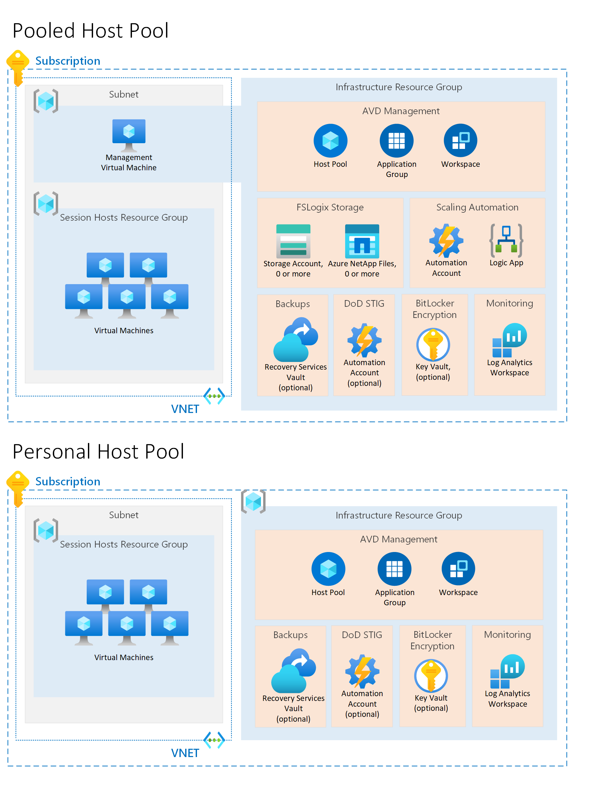

# Azure Virtual Desktop solution

## Deployment Options

### Azure Portal

[](https://portal.azure.com/#create/Microsoft.Template/uri/https%3A%2F%2Fraw.githubusercontent.com%2Fjamasten%2FAzure%2Fmaster%2Fsolutions%2Favd%2Fsolution.json)
[](https://portal.azure.us/#create/Microsoft.Template/uri/https%3A%2F%2Fraw.githubusercontent.com%2Fjamasten%2FAzure%2Fmaster%2Fsolutions%2Favd%2Fsolution.json)

### PowerShell

````powershell
New-AzDeployment `
    -Location '<Azure location>' `
    -TemplateFile 'https://raw.githubusercontent.com/jamasten/Azure/master/solutions/avd/solution.json' `
    -Verbose
````

### Azure CLI

````cli
az deployment sub create \
    --location '<Azure location>' \
    --template-uri 'https://raw.githubusercontent.com/jamasten/Azure/master/solutions/avd/solution.json'
````

## Description

This Azure Virtual Desktop (AVD) solution will deploy a fully operational [stamp](https://docs.microsoft.com/en-us/azure/architecture/patterns/deployment-stamp) in an Azure subscription.  Due to Azure deployment limitations, this solution will allow you to deploy shards to increase capacity while using the same AVD host pool, app group, log analytics workspace, etc. for the whole solution.  See the diagram below for more details:



Depending on the options selected, either a personal or pooled host pool can be deployed with this solution.  The pooled option will deploy an App Group with a role assignment and the required resources to enable FSLogix.  This solution also automates many of the features that are usually enabled manually after deploying an AVD host pool.  Those features are:

- **FSLogix** - deploys the required resources to enable the feature when using Azure AD DS or AD DS:
  - Azure Storage Account or Azure NetApp Files with a fully configured file share
  - Management Virtual Machine with Custom Script Extension to:
    - Domain joins the Storage Account or creates the AD connection on the Azure NetApp Account
    - Sets the required permissions for access to the file share
  - Custom Script Extension on Session Hosts to enable FSLogix using registry settings
- **Scaling Automation** (pooled host pools only) - deploys the required resources to enable the tool:
  - Automation Account with a Managed Identity
    - Runbook
    - Variable
    - PowerShell Modules
  - Logic App
  - Contributor role assignment on the AVD resource groups, limiting the privileges the Automation Account has in your subscription
- **Start VM On Connect** (Optional) - deploys the required resources to enable the feature:
  - Role with appropriate permissions
  - Role assignment
  - Enables the feature on the AVD host pool
- **[Virtual Desktop Optimization Tool](https://github.com/The-Virtual-Desktop-Team/Virtual-Desktop-Optimization-Tool)** - removes unnecessary apps, services, and processes from Windows 10 or 11, improving performance and resource utilization.
- **Monitoring** - deploys the required resources to enable the Insights workbook:
  - Log Analytics Workspace with the required Windows Events and Performance Counters.
  - Microsoft Monitoring Agent on the session hosts.
  - Diagnostic settings on the AVD host pool and workspace.
- **GPU Drivers & Settings** - deploys the extension to install the graphics driver and creates the recommended registry settings when an appropriate VM size (Nv, Nvv3, Nvv4, or NCasT4_v3 series) is selected.
- **BitLocker Encryption** (Optional) - deploys the required resources & configuration to enable BitLocker encryption on the session hosts:
  - Key Vault with a Key Encryption Key
  - Azure Disk Encryption extension on the virtual machines
- **Backups** (Optional) - deploys the required resources to enable backups:
  - Recovery Services Vault
  - Backup Policy
  - Protection Container (File Share Only)
  - Protected Item
- **Screen Capture Protection** (Optional) - deploys the required registry setting on the AVD session hosts to enable the feature.
- **Drain Mode** (Optional) - when enabled, the sessions hosts will be deployed in drain mode to ensure end users cannot access the host pool until operations is ready to allow connections.
- **RDP ShortPath** (Optional) - deploys the requirements to enable RDP ShortPath for AVD.
- **SMB Multichannel** - Enables multiple connections to an SMB share.  This feature is only supported with a premium Azure Storage Account.
- **High Availability** (Optional) - allows the virtual machines to be deployed in either Availability Zones or Availability Sets, to provide a higher SLA for your solution.  This is only applicable to pooled host pools.  SLA: 99.99% for Availability Zones, 99.95% for Availability Sets.

## Assumptions

To successfully deploy this solution, you will need to ensure your scenario matches the assumptions below:

- [Supported operating system and licensing](https://docs.microsoft.com/en-us/azure/virtual-desktop/overview#requirements)
- Landing zone deployed in Azure:
  - Virtual network and subnet(s)
  - Deployed and configured domain services if domain or hybrid joining the session hosts
- Azure Subscription Owner: this solution contains many role assignments so the principal deploying this solution will need to be a Subscription Owner for a successful deployment.

## Prerequisites

To successfully deploy this solution, you will need to first ensure the following prerequisites have been completed:

- Create a service principal or user account to domain join the session hosts if applicable.  Azure AD joined session hosts do not apply.
- Create a security group for your AVD users and if applicable, ensure the principal has synchronized with your domain services (Azure AD DS) or directory (AD DS).
- If you plan to use Azure NetApp Files with FSLogix, complete the following:
  - [Register the resource provider](https://docs.microsoft.com/en-us/azure/azure-netapp-files/azure-netapp-files-register)
  - [Delegate a subnet to Azure NetApp Files](https://docs.microsoft.com/en-us/azure/azure-netapp-files/azure-netapp-files-delegate-subnet)
  - [Enable the shared AD feature](https://docs.microsoft.com/en-us/azure/azure-netapp-files/create-active-directory-connections#shared_ad): this feature is required if you plan to deploy more than one domain joined NetApp account in the same Azure subscription and region.  As of 1/31/2022, this feature is in "public preview" in Azure Cloud and not available in Azure US Government.

## Considerations

If you need to redeploy this solution b/c of an error or other reason, be sure the virtual machines are turned on.  If your host pool is "pooled", I would recommended disabling your logic app to ensure the scaling solution doesn't turn off any of your VM's during the deployment.  If the VM's are off, the deployment will fail since the extensions cannot be validated / updated.

## Post Deployment Suggestion

When deploying FSLogix, a management VM is deployed to facilitate the domain join of the Azure Storage Account, if applicable, and sets the NTFS permissions on the chosen storage solution.  After the deployment succeeds, this VM and its associated resources may be removed.
